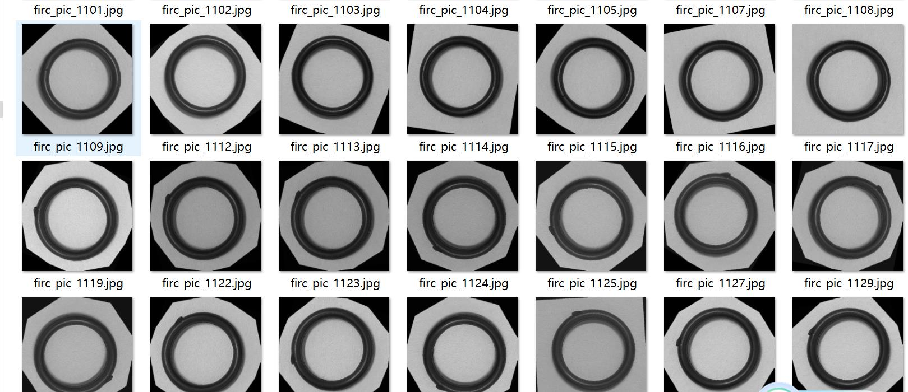
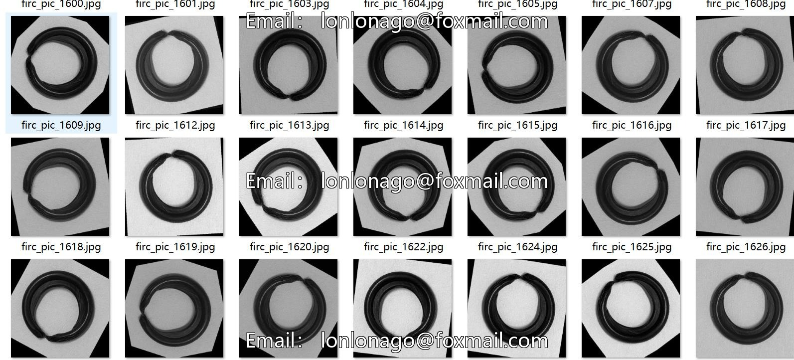
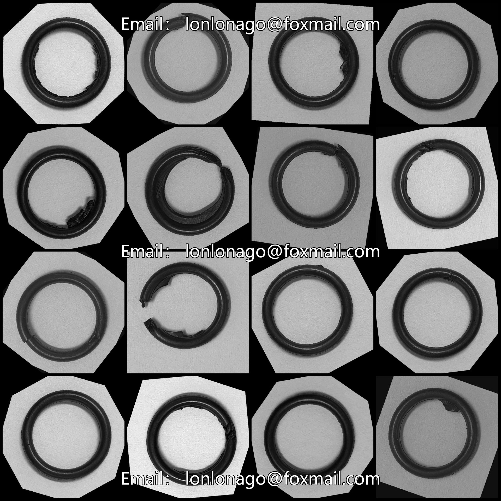
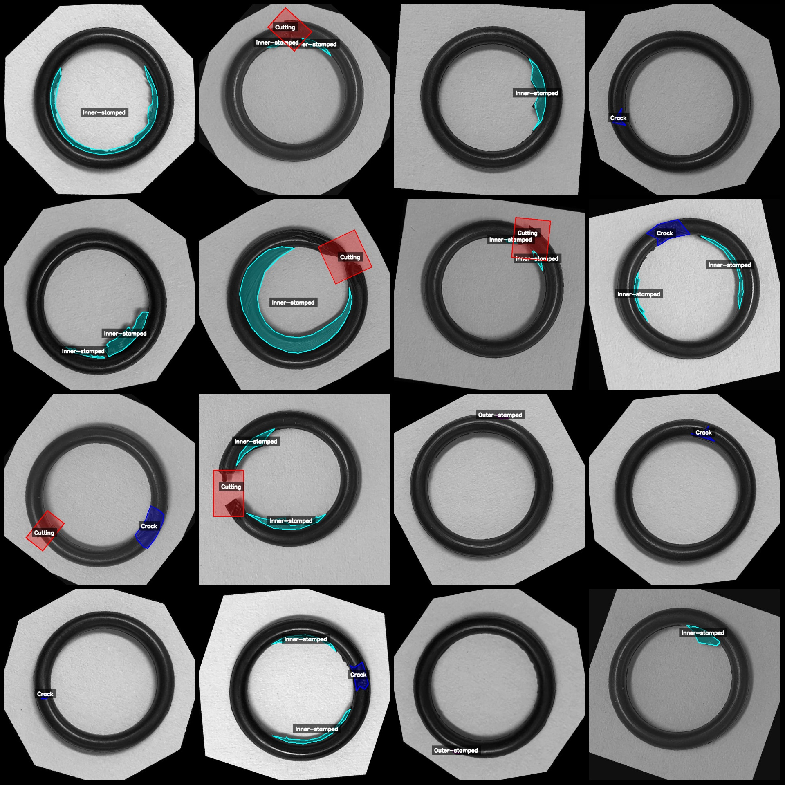
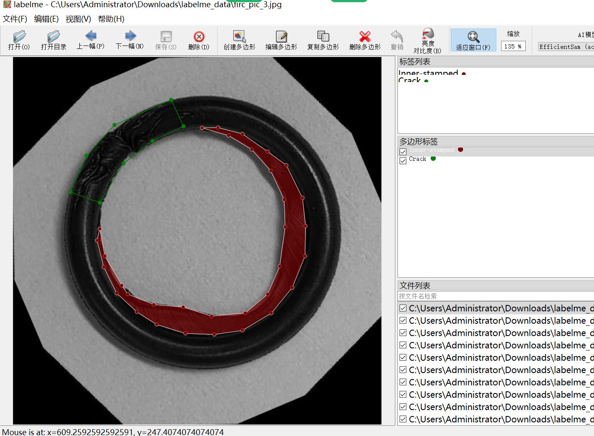

# Seal Ring Quality Inspection and Defect Identification Segmentation Dataset in LabelMe Format

4995 images in LabelMe format with enhancements such as rotation, approximately 50 original images. Please carefully review the image preview.

Dataset format: LabelMe (without mask files, only containing jpg images and corresponding json files)
Number of images (number of jpg files): 4995
Number of annotations (json file count): 4995
Number of annotation categories: 5
Annotation category names: ["Crack", "Cutting", "Inner-stamped", "Ok", "Outer-stamped"]
Number of polygons per category:
Crack (Crack) count = 1719
Cutting (Cutting) count = 1664
Inner-stamped (Inner-stamped) count = 4304
Ok (Ok) count = 384
Outer-stamped (Outer-stamped) count = 779
Total number of polygons: 8850

Using labelme version: 5.5.0
Image resolution: 640x640
Annotation rules: Polygon is drawn around the category.

Important note: The dataset can be opened and edited using LabelMe, but the json dataset needs to be converted into mask or Yolo format for semantic segmentation or instance segmentation.

Special declaration: This dataset does not guarantee the accuracy of the trained model or weight files.

Image preview:

Annotation examples:
Randomly selected 16 images:
Annotation drawing results:

## Image

Here is a pay link on Stripe ( https://buy.stripe.com/3cs8yP7sY87d0vu9AB ). Please contact me lonlonago@foxmail.com after funding $89, and I will send you a complete data files , thank you!

